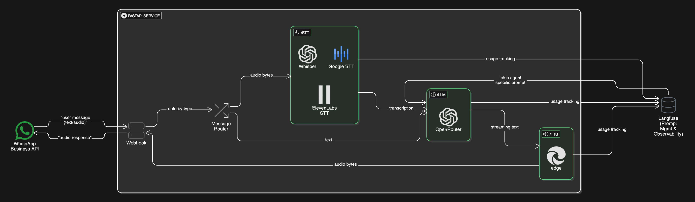
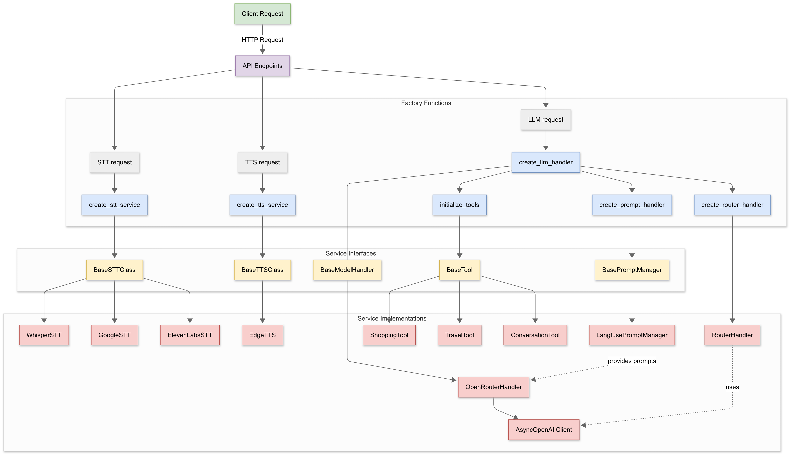
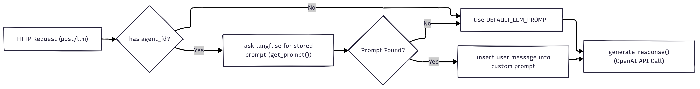
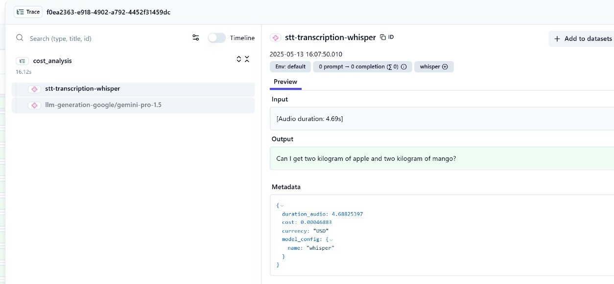

# Developer Insight into PatternAI Agent {: .title}

## Overview {: .sub-heading}
PatternAI Agent is a modular, voice-enabled conversational agent framework built to deliver seamless, human-like interactions via audio and text channels through WhatsApp.

{.projected-img}

The system integrates multiple Speech-to-Text (STT) and Text-to-Speech (TTS) services, connects to powerful Large Language Models (LLMs) through OpenRouter, and leverages Langfuse for prompt tracing and monitoring. It's designed with a clean backend and modular agent profiles for domain-specific use cases like shopping, travel assistance, etc.

### Project Walkthrough: Diving into the System {: .sub-heading}
To understand the operation of the PatternAI Agent, this section will guide through the process flow, from the initial receipt of a user's request to the generation and delivery of a response. Key system components and their interactions will be unpacked.

### The Foundation {: .sub-heading}
- **[/app](#){ style="color:rgb(7,10,39);"}** : This directory houses the core application logic and services that drive the agent's functionality. It includes:

  **[/services](#){ style="color:rgb(7,10,39);"}** : encapsulates the core AI processing logic of the PatternAI Agent. It defines abstract interfaces and provides concrete implementations for key AI processing capabilities.

  These capabilities are organized into the following sub-modules:

???+ note "services/"
    ```
    services/
    ├── llm/
    │   ├── __init__.py                # Factory: creates LLM handler (OpenRouter/custom)
    │   ├── base_handler.py            # Abstract base class for LLMs (defines prompt + interface)
    │   ├── openrouter_handler.py      # Implementation using OpenRouter API
    │   ├── router_handler.py          # Routes queries to tools based on user intent
    │   ├── conversation_history.py    # Maintains chat history with truncation logic
    │   ├── prompts/                   # Prompt management logic (Langfuse or static)
    │   ├── tools/                     # Tool execution logic and OpenAI-compatible tool specs
    │   └── validators/                # Streaming and final response validation logic
    │
    ├── stt/
    │   ├── __init__.py                # Factory: selects STT engine
    │   ├── base_stt_handler.py        # Abstract base class for STT services
    │   ├── whisper_stt.py             # STT via OpenAI Whisper API
    │   ├── google_stt.py              # STT via Google Cloud Speech API
    │   ├── elevenlabs_stt.py          # STT via ElevenLabs API
    │   └── stt_validation.py          # Validation and metrics for STT transcription
    │
    └── tts/
        ├── __init__.py               # Factory: selects TTS engine
        ├── base_tts_handler.py       # Abstract TTS base class, defines text-to-audio interface
        ├── edge_tts.py               # TTS implementation using Microsoft Edge TTS
        └── tts_validation.py         # Validation for text-to-speech output 
    ```

**[/llm](#){ style="color:rgb(7,10,39);"}** : orchestrates intelligent conversation flow through a sophisticated multi-layered architecture that transforms user intent into contextual, validated responses.Rather than simply connecting to language models, this module implements a complete reasoning pipeline that routes requests, maintains conversation context, validates outputs, and ensures reliable agent behavior.

#### LLM Service: Multi-Agent Architecture {: .sub-heading}
##### **Tier 1 : Intent Recognition & Tool Selection**
How does the system know where to send a request like "I need donuts"?

It’s handled by `router_handler.py/` and `tools.py/` using a dedicated LLM as an intelligent dispatcher. Using the configured LLM, it analyzes user intent and selects the most appropriate specialized tool from the available arsenal defined in tools_config.yaml. This isn't simple keyword matching - the router understands context, recognizing the difference between "I need coffee" **(shopping intent)** and "I want to travel to coffee county" **(travel intent)**. The routing system leverages a structured approach:

- Analyzes user input against tool descriptions from **ROUTER_SYSTEM_PROMPT**
- returns JSON-formatted routing decisions via `RouterHandler.route()`
- `initialize_tools()` creates bidirectional mappings between tools and agents
- Tools operate through unified interface `base_tool.py` with consistent behavior
- Each tool knows its agent ID, enabling seamless transition to specialized processing

!!! note "Note"
    New domains can be added by simply creating new tool classes and updating the YAML configuration

##### **Tier 2 : Contextual Conversation Management**
Before any response generation begins, the layer `conversation_history.py/` enriches the interaction with memory. The ConversationHistory class maintains an intelligent sliding window of past interactions, applying both message count limits and token-based truncation to optimize context while preserving memory efficiency.

##### **Tier 3 : Response Generation & Built-in Validation**
This layer orchestrates LLM interaction through OpenRouterHandler, serving as the bridge between the internal agent system and external language models. This handler manages the complete response lifecycle:
This handler manages the complete response lifecycle with integrated prompt management, streaming generation, real-time Pydantic validation of all streaming LLM responses to ensure structured output formatting and type safety.


**[/stt](#){ style="color:rgb(7,10,39);"}** : a unified interface for converting speech to text using multiple cloud providers. It supports Whisper (OpenAI), Google Cloud Speech-to-Text, and ElevenLabs services through a common abstraction layer.

**[/tts](#){ style="color:rgb(7,10,39);"}** : a standardized interface for converting text to speech using various synthesis engines. Currently implemented with Microsoft Edge's TTS service, the module is designed for easy extensibility to support additional providers.

### Service Traversal {: .sub-heading}
The system operates through a series of coordinated steps that leverage the abstract interfaces and factory pattern to process user requests.
{.projected-img}

When a client interacts with the system, the request follows a consistent architectural pattern across all service types (STT, LLM, and TTS):

While processing an audio file, the system uses factory functions like `create_stt_service` to instantiate the appropriate service (Whisper, Google STT, or ElevenLabs). These factories handle configuration parsing, environment variable injection, and service initialization in one centralized location.

After initialization, the system interacts with each service through its abstract interface. For example, calling `transcribe()` on any STT service produces a text transcript regardless of which underlying provider (Whisper, Google, or ElevenLabs) is actually processing the audio.

The LLM processing and text-to-speech (TTS) flows follow a similar architectural pattern.

- For LLMs, the system uses create_llm_handler to instantiate an OpenRouterHandler, which acts as the gateway to OpenRouter-backed language models. It supports prompt injection, conversation context, real-time streaming, and structured response validation, as detailed in the LLM service section above.
- For TTS, the `create_tts_service` factory function initializes an EdgeTTS service that converts text input into audio bytes using the Microsoft Edge TTS engine.

While models provide services by default, their performance can vary, a topic we'll explore using Langfuse later. Keeping that in mind, we've built a framework that allows developers to integrate models as they please.

#### How to plug in: {: .sub-heading}
For instance, let's integrate a new STT service:

- Implement a handler class inheriting from `BaseSTTClass`.
- Add it to the `service_registry` in `create_stt_service`.

```python
service_registry = {
    "whisper": WhisperSTT,
    "google": GoogleSTT,
    "elevenlabs": ElevenLabsSTT,
    "new_service": NewSTTService  # add here
}
```

Also we've optimized performance by implementing factory functions with LRU caching and custom cache logging decorators, preventing redundant service creation when the same configuration is requested multiple times. This allows dynamic, efficient, and configurable creation of service instances at runtime.

**[/tests](#){ style="color:rgb(7,10,39);"}** : This directory contains unit and integration tests for the application logic, ensuring the reliability and correctness of the core functionalities. Tests are executed using the pytest framework.

To run all tests, use the following command:

```bash
poetry run pytest
```
#### Test Structure {: .sub-heading}

The **[/tests](#){ style="color:rgb(7,10,39);"}** directory is organized by module, with each file typically containing tests for a specific part of the application:

- `test_llm.py`: Contains tests for the Large Language Model (LLM) integration, including schema validation and semantic comparison of LLM outputs
- `test_stt.py`: Contains tests for the Speech-to-Text (STT) service, covering different STT providers and transcription functionality
- `test_tts.py`: Contains tests for the Text-to-Speech (TTS) service, including service creation, configuration, and speech synthesis
- `conftest.py`: Provides helper functions and fixtures used across multiple test files. For example, the `cleaned_json` function normalizes JSON outputs from LLMs, which is crucial for testing LLM responses

#### Refine & Tune {: .sub-heading}

Creating safer, more humane conversational agents meant taking on the responsibility of ensuring responses remain fair, respectful, and trustworthy — not just intelligent.

With that in mind,
**[/filters](#){ style="color:rgb(7,10,39);"}** : Provides a modular text filtering framework that enforces ethical and contextual guardrails for agent outputs. It is responsible for detecting and handling:  

- Personally Identifiable Information (PII)  
- Biased language  
- Profanity  

Every filter is pluggable and configurable, allowing easy customization per agent use case.

##### Design Philosophy {: .sub-heading}
Filters follow the Strategy Pattern, built on a shared `BaseFilter` interface. Each filter implements an `apply(text: str) -> str` method, ensuring consistency and interchangeability.

```python
class BaseFilter(ABC):
    @abstractmethod
    def apply(self, text: str) -> str:
        …
```
!!! note "Note"
    This design allows us to dynamically register and apply filters, configured declaratively through a YAML file.

##### Rule Engine {: .sub-heading}
At runtime, the RuleEngine loads filters defined in configs.yaml, instantiates them, and applies them sequentially to incoming text enabling  centralized control,  easy reordering or disabling of filters and detailed logging of filter application.
##### Filters in Use 
- BiasFilter – Replaces predefined biased terms with neutral ones using regex-based replacements.
- PIIFilter – Detects and anonymizes PII in plain text and json using presidio, with field-specific handling for dates and locations.
- ProfanityFilter – Censors offensive language using both regex and the better_profanity library.


### Versatility and Modularity {: .sub-heading}
- **[/clients](#){ style="color:rgb(7,10,39);"}** : provides a flexible framework for implementing domain-specific conversational agents with WhatsApp integration. Each client gets its own isolated configuration and implementation while sharing core AI services (STT/TTS/LLM).

#### API Endpoints {: .sub-heading}
With the core services for STT, TTS, and LLM dynamically monitored through our modular framework, these capabilities are made accessible to client applications via a set of clean, RESTful API endpoints. These endpoints handle everything from speech transcription to language and audio generation, providing a unified interface for seamless multi-modal conversations.

The service exposes the following endpoints:

| Endpoint | Method | Description |
|----------|--------|-------------|
| `/health` | GET | Health check endpoint |
| `/stt` | POST | Speech-to-Text transcription |
| `/llm` | POST | Process text with LLM models |
| `/tts` | POST | Text-to-Speech synthesis |

#### Health Check {: .sub-heading}
Verify if the service is running:

```bash
curl -X GET "http://localhost:5000/health"
```

**Response:**
```json
{"status": "ok"}
```

#### 1. Speech-to-Text (STT) {: .sub-heading}
Convert audio to text using the `/stt` endpoint.

**Request**

```bash
curl -X POST "http://localhost:5000/stt" \
  -H "Content-Type: application/octet-stream" \
  -H "STT-Model: whisper" \
  --data-binary @"audio_file.webm"
```

**Available STT models:**
- `whisper` (OpenAI's Whisper model)
- `google` (Google Speech-to-Text)
- `elevenlabs` (ElevenLabs STT service)

The model can be selected via the `STT-Model` header. If not specified, the default model configured in `configs.yaml` will be used.

**Response:**
```json
{
  "status": "success",
  "transcription": "This is the transcribed text from the audio.",
  "request_id": "unique-request-id"
}
```

#### 2. Language Model (LLM) Processing{: .sub-heading}
Process transcribed text with an LLM model using the `/llm` endpoint.

**Request**

```bash
curl -X POST "http://localhost:5000/llm" \
  -H "Content-Type: application/json" \
  -d '{
    "transcription": "What items do you have on sale?",
    "model_name": "anthropic/claude-3-haiku-20240307",
    "agent_id": "agent_shopping"
  }'
```

**Notes:**
- `model_name`: Specifies which LLM model to use (required if `fallback_enabled` is set to false in configuration)
- `agent_id`: Optional parameter to specify which agent profile to use (e.g., "agent_shopping", "agent_travel")

**Response:**

The response is streamed in plain text format:

```
request_id: unique-request-id

We have several items on sale this week. Our fresh produce section has discounts on seasonal fruits and vegetables. In the grocery aisle, we have deals on pasta, rice, and canned goods. The bakery section has a buy-one-get-one offer on whole wheat bread. Is there anything specific you're looking for?
```

#### 3. Text-to-Speech (TTS) {: .sub-heading}
Convert text to speech using the `/tts` endpoint.

**Request**

```bash
curl -X POST "http://localhost:5000/tts" \
  -H "Content-Type: application/json" \
  -H "TTS-Model: edge_tts" \
  -d '{
    "message": "Hello, we have several items on sale this week. Is there anything specific you'\''re looking for?"
  }' \
  --output speech.mp3
```

**Available TTS models:**
- `edge_tts` (Microsoft Edge TTS)

**Response:**

The response is an audio file in MP3 format with appropriate headers:

```
Content-Type: audio/mpeg
Content-Disposition: attachment; filename=speech.mp3
X-Request-ID: unique-request-id
```

### Langfuse For Prompt Management {: .sub-heading}

> "For a transparent view into the agent's language-driven interactions and a pathway to iterative improvement, the framework leverages Langfuse for robust prompt management and comprehensive monitoring."

To ensure that PatternAI Agent remains highly modular and adaptable, prompt management is architected with a clear separation of concerns.

We've established an abstract **Base Interface** (`BasePromptManager`) - defined in `/base_prompt_handler.py`, which serves as an abstract interface for prompt retrieval. This allows us to seamlessly integrate various prompt management solutions without impacting the core logic that interacts with LLMs.

Our current implementation **LangfusePromptManager** - defined in `/langfuse_handler.py`, leverages the Langfuse SDK to dynamically fetch prompt definitions from a centralized prompt store. This approach offers several key advantages:

- **Centralized Prompt Management**: All prompt templates are managed within Langfuse, providing a single source of truth and simplifying updates.
- **Dynamic Updates**: Changes to prompts in Langfuse are reflected in the agent without requiring code deployments.
- **Version Control & History**: Langfuse provides built-in versioning and history tracking for prompts, crucial for experimentation and rollback.
- **Observability**: Langfuse integrates seamlessly with prompt tracing and monitoring, offering valuable insights into prompt performance and usage.

<br>

{.projected-img}

<br>

The `PromptManager` interface dictates that any concrete implementation must provide a `get_prompt(name)` method. Our `LangfusePromptManager` fulfills this contract by initializing the Langfuse SDK using environment variables (`LANGFUSE_PUBLIC_KEY`, `LANGFUSE_SECRET_KEY`, `LANGFUSE_HOST`) and retrieving prompts by their unique name using the Langfuse client:

```python
self.client.get_prompt(name)
```

This decoupling empowers us to evolve our prompt management strategy in the future – simply by implementing a new class that adheres to the `PromptManager` interface. This design ensures that the PatternAI Agent remains flexible and maintainable as our requirements evolve.


!!! note "Note"
    Want to customize or extend the monitoring? <br>
    You can easily plug in your own prompt management or analytics solution too. 
    To learn more about Langfuse, visit their official documentation ([https://langfuse.com/docs](https://langfuse.com/docs)).


#### Langfuse For Tracking {: .sub-heading}

To gain precise observability into the performance and behavior of our multi-modal services – including language modeling (LLM), speech-to-text (STT), and text-to-speech (TTS) – we integrate Langfuse. This provides structured, end-to-end tracing of interactions across services, enabling detailed logging of input/output data, metadata, cost, and latency for each API call in our application pipeline.

#### Why We Use It Here {: .sub-heading}

In multi-modal AI architectures, especially those combining LLM, STT, and TTS services, monitoring individual service calls and aggregating their performance and cost metrics can be complex. Langfuse simplifies this by:

- Enabling real-time cost tracking per API call.
- Capturing performance metrics such as latency, token usage, audio duration, and processing time.
- Providing unified tracing across services, allowing correlation of input/output pairs and their associated metadata.
- Supporting prompt versioning and retrieval analytics for LLM generations.

#### Langfuse Integration & Usage {: .sub-heading}

To enable request tracing and detailed observability across all AI components, Langfuse is initialized using credentials securely stored in environment variables.

Langfuse's SDK is initialized in each tracker with:

```python
self.langfuse = Langfuse(
    public_key=os.getenv("LANGFUSE_PUBLIC_KEY"),
    secret_key=os.getenv("LANGFUSE_SECRET_KEY"),
    host=os.getenv("LANGFUSE_HOST")
)
```

This Langfuse instance is then used throughout the application to track operations and metrics for each service.

#### Example Usage

Langfuse tracing relies primarily on two methods:

- `trace()` is used to start a new tracing session, encapsulating the full flow of a request.
- `generation()` records specific input/output events, such as transcriptions, responses, or synthesized speech, including performance and cost metadata.

**Example: Starting a trace**

```python
trace = self.langfuse.trace(
    name="cost_analysis",
    user_id=user_id,
    metadata={"environment": os.getenv("ENV", "dev"), "source": "speech_input"}
)
```

**Example: Logging a generation event**

```python
trace.generation(
    name=f"stt-transcription-{model_name}",
    input=f"[Audio duration: {audio_duration_sec:.2f}s]",
    output=transcription,
    model=model_name,
    metadata={
        "duration_audio": round(audio_duration_sec, 8),
        "cost": round(cost, 8),
        "currency": "USD",
    }
)
```

#### Service specific trackers {: .sub-heading}

We encapsulate Langfuse functionality within dedicated tracker classes for each core service.

**LLMTracker** → `/clients/demo/llm_tracker.py`

Handles all tracing related to LLM interactions. It initializes with model-specific configuration such as token pricing and supported providers from `configs.yaml`, starts a trace with `start_trace()`, and records generation event with Langfuse using `track_llm()`.

###### Metrics Tracked:
- Input/output tokens
- Latency and response time
- Cost per model/token type
- Prompt metadata

**STTTracker** → `/clients/demo/stt_tracker.py`

Manages speech-to-text tracing. It loads model and pricing info, starts a trace via `start_trace()`, and logs the transcription with `track_stt()`.

###### Metrics Tracked:
- Audio duration
- Transcription text
- STT model used
- Cost per second

**TTSTracker** → `/clients/demo/tts_tracker.py`

Tracks text-to-speech operations. At initialization, it reads the default voice model and pricing scheme—covering both per-character and per-second billing—from the config, starts a trace with `start_trace()`, and logs synthesis details in `track_tts()`.

###### Metrics Tracked:
- Character count
- Audio duration
- Processing time
- Model and voice used
- Combined cost (char + audio-based)

All configuration values — such as pricing, model names, and default services — are centrally managed via `configs.yaml`.

After each conversation, the metrics are calculated and visualized in Langfuse's dashboard, where teams monitor cost-per-session or drill into LLM token usage by model.
<br>

{.projected-img}


### WhatsApp Integration {: .sub-heading}

Support for WhatsApp messaging is currently being developed to enable seamless voice and text interactions through the platform.
 Hop into Whatsapp [Integration.](whatsapp.md)
---

This document has provided a comprehensive overview of the PatternAI Agent, a modular framework for building voice-enabled conversational agents. We covered the system's architecture, key components, and how they interact to process user requests. The agent's flexibility is enabled by its modular design, support for multiple STT, TTS, and LLM providers, and the use of Langfuse for detailed observability.

#### Next Steps {: .sub-heading}

To get started with the PatternAI Agent:

1. Ensure you have met all the system requirements.
2. Follow the instructions in the [Installation Guide](setup.md) to set up the environment and dependencies.
3. Explore the example clients in the `clients/` directory.

### Resources {: .sub-heading}

- **GitHub Repository**: [PatternAI Agent](https://github.com/PatternAILabs/patternai-agent-build.git)

We encourage you to leverage the PatternAI Agent to create innovative and engaging conversational experiences. We welcome your feedback and contributions!

<br>