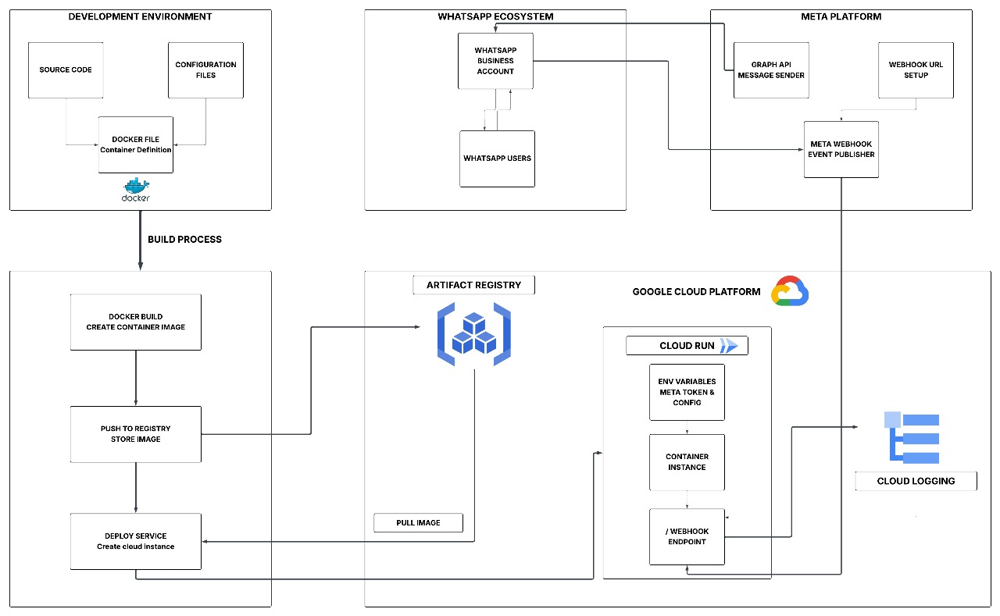
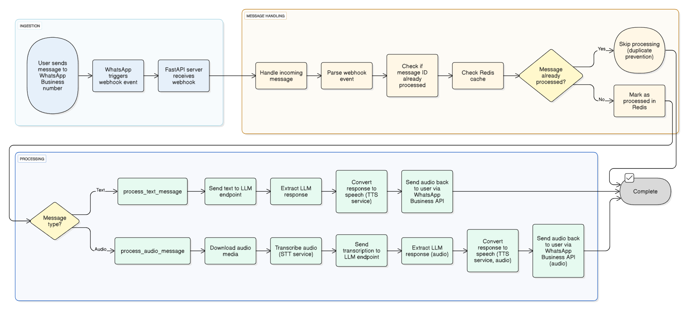

# PatternAI: WhatsApp Node {: .title}

The WhatsApp Integration module extends the PatternAI Agent framework to support seamless, multi-modal conversational interactions through WhatsApp. It uses **FastAPI** to handle incoming webhook events from the **Meta WhatsApp Business API**, integrating tightly with the agent’s LLM, STT, and TTS services.

### System Architecture {: .sub-heading}

The module is structured for cloud-native deployment and includes:

#### Development Environment {: .sub-heading}

- **Source Code**: A FastAPI-based server to process WhatsApp messages via `/webhook`.
- **Dockerfile**: Defines the container definition for packaging the application.
- **Configuration**: Environment variables and Meta API credentials for secure operations.

#### Deployment Workflow {: .sub-heading}

1. **Docker Build** – Container image is created from the source.  
2. **Push to Registry** – Stores the image in Google Container Registry.  
3. **Deploy** – Creates or updates the Cloud Run service.

#### Google Cloud Platform Infrastructure {: .sub-heading}

- **Container Registry**:  
  Stores Docker images at gcr. Provides versioned image storage for rollbacks. Integrates with Cloud Run for automatic deployments.

- **Cloud Run**:  
  Container runs the WhatsApp webhook service. Exposes `/webhook` endpoint for Meta events. Environment variables store Meta tokens and configuration.

- **Cloud Logging**:  
  Centralized logging for observability.

{.projected-img}

### Message Processing Flow {: .sub-heading}

Incoming WhatsApp messages go through a structured pipeline:

#### Components:

- `demo_whatsapp.py`: Entry point for handling FastAPI webhook logic.  
- `whatsapp_base.py`: Base class that contains AI integration logic (LLM, STT, TTS).

{.projected-img}

### Sequence of Operations

| Step | Operation |
|------|-----------|
| 1 | User sends a message (text or audio) to the registered WhatsApp Business number. |
| 2 | Meta sends a webhook event with the message data via an HTTP POST request to `/webhook` on our FastAPI server. |
| 3 | Webhook Handler (`handle_incoming_message`) in WhatsApp class (from `demo_whatsapp.py`, inheriting `WhatsAppBase`) receives and logs the incoming data, ignoring non-user status updates. |
| 4 | Parse and Validate message using `parse_webhook_event()` from `WhatsAppBase`. |
| 5 | Deduplication check against Redis using `is_duplicate_message(message_id)`. If duplicate: `{"status": "duplicate", "message_id": message_id}`. If new: mark as processed. |
| 6 | Message Type Detection to route message to either `process_text_message` (for text) or `process_audio_message` (for voice). |

### Message Handling {: .sub-heading}

#### Text Message Flow

1. `_call_llm()` processes the text via LLM.  
2. `_extract_message()` retrieves the LLM’s reply.  
3. `_call_tts()` synthesizes the reply to audio.  
4. `send_audio_message()` delivers audio back to the user.

#### Audio Message Flow

1. `download_media()` retrieves the audio file.  
2. `_call_stt()` transcribes the audio.  
3. `_call_llm()` generates a response.  
4. `_call_tts()` converts it to audio.  
5. `send_audio_message()` returns the audio reply.


## API Endpoint {: .sub-heading}

| Endpoint   | Method | Description                         |
|------------|--------|-------------------------------------|
| `/webhook` | POST   | Receives and processes WhatsApp events |

On failure, a fallback message is sent:  
```Sorry, we couldn't process your request. Please try again later```.  
This ensures the system degrades gracefully under failure conditions.

### Logging & Observability {: .sub-heading}

- Centralized logging via **Cloud Logging**  
  Tracks:
  - Incoming webhook events  
  - AI processing  
  - Outgoing replies  
  - Deduplication logic  
  - Processing errors
