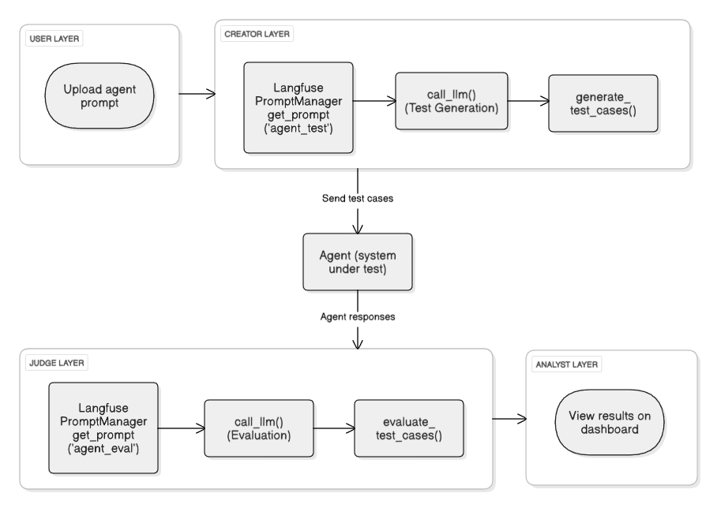

# AgentTest: From Prompt To Performance {: .title}
#### REVOLUTIONIZING HOW TEAMS TEST, EVALUATE, AND PERFECT THEIR CONVERSATIONAL AI {: .sub-title}

Quality assurance for conversational AI agents presents critical challenges: manual test creation scales poorly, evaluation criteria lack consistency, and comprehensive edge case coverage remains difficult to achieve systematically. Development teams face hurdles in validating agent behavior across diverse scenarios while maintaining objective assessment standards.

Imagine handing your AI agent to an intelligent testing system that operates autonomously — generating its own test cases, judging responses with expert precision, and delivering clear, actionable insights.

That's exactly what AgentTest delivers.

One prompt is all it takes — <strong> AgentTest </strong>handles the rest

<div style="display: flex; justify-content: space-around; text-align: center; margin-top: 2rem; margin-bottom: 2rem; gap: 2rem; flex-wrap: wrap;">

  <div style="flex: 1; min-width: 200px;">
    
    <p><strong>Creator</strong><br>
    <em>“Generating</em> varied<br>
    and high impact<br>
    test cases–automatically”</p>
  </div>

  <div style="flex: 1; min-width: 200px;">
    
    <p><strong>Judge</strong><br>
    <em>“Evaluating</em> every response<br>
    across multiple performance<br>
    metrics – with precision”</p>
  </div>

  <div style="flex: 1; min-width: 200px;">
    
    <p><strong>Analyst</strong><br>
    <em>“Presenting</em> results<br>
    as a clear, interactive<br>
    report you can act on”</p>
  </div>

</div>

<strong>Onward, AgentTest expands on these roles with a fully automated testing pipeline</strong> — taking your agent’s prompt and transforming it into a comprehensive suite of test cases, spanning everyday requests to edge‑case scenarios in multiple languages. By structuring all outputs in JSON, it ensures compatibility with automated evaluation, debugging, and continuous improvement workflows.

**Beyond generating test cases, AgentTest also serves as a judge for your AI agents.** Each response from the agent is evaluated using a Langfuse‑driven scoring rubric, which measures performance across key dimensions such as language quality, requirement coverage, tone appropriateness, domain relevance, factual accuracy, and task fulfillment. This structured evaluation transforms subjective assessments into quantifiable, reproducible results, allowing teams to pinpoint strengths and areas for improvement. 

**The framework further evolves into an analyst, distilling test outcomes into an interactive, insight‑driven dashboard.** It displays test results via visual reports, pass/fail summaries, and detailed feedback for each case. Whether you're validating changes or tracking regressions, AgentTest provides the clarity and confidence you need to iterate fast and improve effectively.     

**“Together, these capabilities position AgentTest as a unified, end‑to‑end testing pipeline for seamless agent validation”**

## The Architecture Behind the Roles {: .sub-heading}
{.projected-img}

Thus far, we’ve explored the conceptual architecture — now let’s map it to the actual Python modules, going beyond high‑level concepts into implementation.

## Prompt Management with Langfuse {: .sub-heading}

<strong>[LangfusePromptManagement](https://langfuse.com/docs/prompt-management/get-started)</strong> helps to version control and manage prompts collaboratively in one place. It’s where teams (both technical and otherwise) create, organize, and iterate on prompts without digging into the codebase.

The prompt management dashboard lists all prompts by name and version. From there we can create, edit, label, and version-control prompts directly through the web console.

In our project, we integrated Langfuse to fetch prompts dynamically at runtime using a dedicated LangfusePromptManager class (defined in langfuse_prompt_manager.py). This class initializes a Langfuse client using secure environment variables and provides a simple method to retrieve prompts by name.

By using this setup, prompt logic remains completely decoupled from application logic, making it easy to iterate on prompts during development and testing — without needing to redeploy the system. Any changes made on the Langfuse dashboard are reflected instantly in the agent behavior during test generation or evaluation.

Here’s a simplified view of how the prompt is retrieved in our code:
```python
# Fetching a prompt from Langfuse
prompt_manager = LangfusePromptManager()
prompt = prompt_manager.get_prompt("your_prompt_name")

```
This integration has significantly improved flexibility and collaboration during prompt tuning, while maintaining a clean separation of responsibilities within the codebase.

#### `/agent_test.py` – Test Case Generation & Prompt Validation
As introduced earlier, This module handles the automated generation of test cases — implemented in agent_test.py. It begins by fetching a reusable test case template from Langfuse through LangfusePromptManager, dynamically fills it with the agent’s configuration prompt and desired number of cases, and then invokes an LLM to generate structured input–output examples.

##### Code snippets:
Template retrieval

The generator retrieves a Langfuse-stored prompt template using LangfusePromptManager:
```python
template = prompt_manager.get_prompt("agent_test")
``` 
Template filling & llm invocation

The agent prompt and test case count are dynamically inserted into the template:
```python
filled_prompt = fill_prompt(template, {
    "agent_prompt": agent_prompt,
    "num_cases": n,
})
llm_output = call_llm(filled_prompt)
```
Robust json extraction

LLM outputs are often noisy or malformed. To handle this, the module implements a recovery parser:
```python
def extract_json(text: str) -> list:
    # Attempts clean JSON parsing
    # Falls back to partial extraction of valid objects
```

> “To maintain test diversity and prevent redundancy, the module derives a unique signature for each generated case and filters    out duplicates before saving. This ensures that every test case contributes new coverage rather than repeating existing ones, making the generated suite more comprehensive and realistic for agent evaluation.”


#### `/agent_eval.py` – LLM‑Driven Evaluation & Scoring

This module acts as an autonomous evaluation engine, using a Langfuse‑managed evaluation template and an LLM‑based judge to score agent responses against user expectations. It evaluates multiple dimensions — language quality, requirement coverage, tone, domain consistency, factual accuracy, and task fulfillment — producing a structured, explainable JSON report for each test case.

##### Code snippets:
Evaluation template retrieval

An evaluation prompt is fetched from Langfuse to ensure consistent, centrally managed criteria:
```python
template = prompt_manager.get_prompt("agent_eval")
```

Dynamic context injection

The test case’s user input and the agent’s response are injected into the template before sending to the LLM:
```python

filled_prompt = fill_prompt_template(template, {
    "user_input": user_input,
    "llm_response": llm_response
})
```

LLM‑based judgement & json parsing

 The LLM produces a structured evaluation, which is then cleaned and parsed:
```python
raw_output = call_llm(filled_prompt)
cleaned_output = strip_markdown_json(raw_output)
evaluation = json.loads(cleaned_output)
```

> ###### **Inside the logic:**
- Date‑aware reasoning: Interprets relative dates (e.g., “tomorrow”, “next weekend”) based on the current date ({{today}}) and penalizes incorrect interpretations.
- Hallucination detection: It flags responses where the agent fabricates details instead of requesting clarification.
- Error‑tolerant parsing: If the LLM returns malformed JSON, the module logs the raw response and gracefully recovers, ensuring no evaluation is silently lost.
- Explainable scoring: Each dimension includes a score and justification, making the evaluation transparent and actionable for developers.


#### Here’s how you can start testing with AgentTest — READY?

Follow these steps :

1. Upload your agent configuration prompt.

2. Confirm its validity 

```markdown
Given a prompt is submitted for evaluation 
When the system checks the prompt 
Then the prompt must satisfy the following: 
- The prompt must include enough context or rules for response generation 
- The length of the prompt must be at least 100 characters 
- The prompt must be written in a supported and properly formatted language 
``` 

!!! note "Note"
    If the prompt does not meet these conditions, the prompt will be rejected.

#### What You’ll See
Once the evaluation begins, AgentTest provides,

- Visual metrics dashboard showing pass/fail breakdown.
- Individual test case insights — showing what failed and why.
- Downloadable JSON reports: For deeper inspection or integration into QA pipelines.


#### Passing Parameters
A test is considered passed when,

- All metric scores are consistently high (typically ≥4/5).
- The Judge’s final verdict is "overall_judgment": "Pass"

```bash
Given an agent response is evaluated
When the Judge LLM analyzes the output
Then it is scored based on:
  - Language Quality: checks grammar and fluency
  - Requirement Coverage: ensures all input details are addressed
  - Tone Appropriateness: assesses politeness and helpfulness
  - Domain Appropriateness: confirms relevance to agent’s role
  - Factual Accuracy: flags hallucinated or incorrect content
  - Task Fulfillment: evaluates whether the user’s goal is achieved
```
Want to see it in action?
 Watch the video 

<div style="display: flex; justify-content: center; margin-top: 1rem;">
  <video width="720" height="auto" controls preload="metadata" style="box-shadow: 0 4px 12px rgba(0,0,0,0.15); border-radius: 8px;">
    <source src="/assets/demo.mp4" type="video/mp4">
  </video>
</div>


