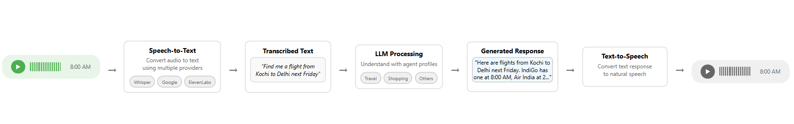

 
# PatternAI Agent: Voicing a Change {: .title}

In these times, where attention is fleeting and retention is hard-won, people value speed, ease, and familiarity more than ever. User convenience is king and businesses must connect with people on the platforms they already use. PatternAI Agent meets users where they are, transforming everyday chat apps into intelligent, voice-powered assistants that feel natural and effortless. Whether it's placing an order, getting support, or booking a trip, customers can simply send a voice message or a text, and get instant, helpful responses.

PatternAI Agent lets people talk naturally with a smart assistant on WhatsApp — using voice or text — just like chatting with a friend.

Built with the flexibility of developers and the needs of enterprises in mind, PatternAI integrates cutting-edge AI models for speech, language, and dialogue — all within a WhatsApp-native experience.
### What Makes It Great? {: .sub-heading}

**Can't type? Talk**: Customers can speak naturally to a WhatsApp assistant, hands-free or type personifying it into a companion.

**Familiar & Convenient**: No new apps to download. Everything happens right inside WhatsApp, a platform people already love.

**Instant Replies**: Get instant, streaming responses for fluid conversations.

**Always Reliable**: Even in noisy or difficult situations, it keeps conversations smooth and helpful.

### Who's It For? {: .sub-heading}

#### 1. Businesses / Clients / Developers:
These are the people or companies who adopt and integrate PatternAI Agent into their services.

**Examples:**
- E-commerce platforms that want voice-based customer support.
- Travel agencies offering real-time, conversational bookings via WhatsApp.
- Customer support teams looking to reduce manual workloads.
- Developers / system integrators building custom agents for clients.

#### 2. End Users (Consumers / Customers):
These are the users of WhatsApp who interact with the PatternAI-powered agents without knowing what's behind the scenes.

**Examples:**
- A customer tracking their online order via voice message.
- Someone booking a trip through WhatsApp by speaking to an assistant.
- Someone seeking product recommendations in a native language.

### Let's Converse, Step by Step {: .sub-heading}

With PatternAI, conversations on WhatsApp just flow — smart, fast, and surprisingly human.

{.projected-img}

When you send a voice message:

1. **Your message is heard.**  
   The assistant listens and understands what you said.

2. **It figures out what you need.**  
   Whether it's booking a flight, checking an order, or answering a question – it gets the context.

3. **You get a quick, helpful reply.**  
   The assistant responds instantly in voice – based on what works best for you.

That's it. No waiting. No typing (unless you want to). Just natural conversations.

### ❓ Frequently Asked Questions {: .sub-heading}

#### 1. Can I change the voice of the assistant?
Not at the moment. The assistant uses a fixed voice that's chosen by the developers for clarity and consistency. While the system supports different voice types internally, users cannot change the voice directly. We may offer more voice options in future updates.

#### 2. How do I clear all my data from the assistant?

#### 3. Can I book an Uber using the agent?
Not yet — but integrations like Uber are in our roadmap. Stay tuned for updates!

#### 4. Is my personal data shared between domains or stored without my consent?
No. PatternAI is privacy-first. Your data is only used for that specific interaction unless you explicitly allow otherwise.

#### 5. How much data is saved to the system?
Only the data needed to process your current request is temporarily stored. For transparency, the assistant uses Langfuse to track performance and cost, not to store personal content permanently.

#### 6. Can I send a photo or video of the items I want to order?
For now, only voice and text messages are supported. Visual input features may be added in future versions.

#### 7. Can I list places I want to visit and have the agent plan a route?

#### 8. What if my voice message had a mistake? Can I correct it?
No worries! You can simply say "correct that" or resend the message — the assistant will wait for your confirmation before moving on.

#### 9. Do customers need to install anything?
No installation required — everything runs inside WhatsApp. Just send a message and you're in.

#### 10. How many languages can the assistant understand?
The assistant can recognize multiple languages depending on the speech model (like Google STT or Whisper). It automatically detects the language based on your voice or text input.

### What's Next? {: .sub-heading}

We are currently in the process of integrating more advanced features and domains, more updates on the way…

#### Try it for yourself!

PatternAI Agent is here to make your daily tasks easier — your assistant listens, understands, and responds — just like a real conversation.

**Ready to START?**

"Say it. Solve it."

 